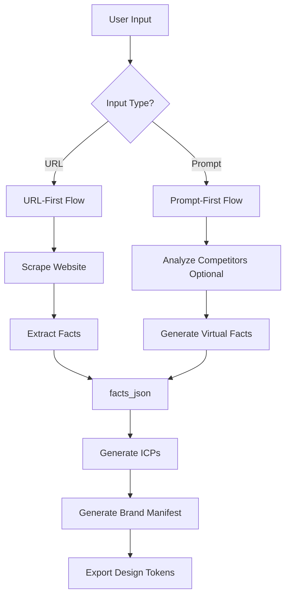

# Prompt-First Flow Refactor Plan
## From "Analyze Existing Brand" to "Create New Brand from Idea"

**Created**: 2025-11-27  
**Context**: Strategic pivot to serve startup builders (Lovable/Bolt/Cursor users)  
**Goal**: Enable "vibe create" - generate ICP + brand manifests from natural language prompts instead of URLs

---

## 🎯 Executive Summary

### The Opportunity

**Current Flow** (URL-first):
```
User pastes website URL → Scrape → Extract facts → Generate ICPs → Create brand
```

**New Flow** (Prompt-first):
```
User describes idea + competitors → AI extracts "virtual facts" → Generate ICPs → Create brand
```

### Target User Persona

**Name**: Alex, Indie Hacker / Startup Builder  
**Tools**: Lovable.dev, Bolt.new, Cursor AI, v0.dev  
**Pain Point**: "These AI coding tools are amazing for features, but terrible for branding. I have a startup idea but no existing website to analyze. I need brand identity + messaging BEFORE I build the product."

**Current Flowtusk limitation**: Requires existing website → Doesn't work for Alex's use case

---

## 📊 Research Findings

### 1. **Current Architecture Analysis**

#### Evidence Chain System
- **Core**: All outputs reference `sourceFactIds` linking back to website facts
- **Files**: `lib/prompt-templates.ts`, `lib/validators.ts` (marked as CRITICAL - NEVER TOUCH)
- **Insight**: This is Flowtusk's competitive moat - verifiable, traceable outputs

**Question**: Can we preserve evidence chain without a real website?  
**Answer**: YES - by generating "virtual facts" from the prompt + competitor analysis

#### Current Data Flow
```typescript
// app/api/analyze-website/route.ts
1. Scrape website (Jina AI)
2. Extract facts_json (GPT-4o with buildAnalyzePrompt)
3. Validate structure
4. Cache result
5. Return { content, factsJson, metadata }

// Then:
facts_json → buildICPPrompt → ICPs
ICP + facts_json → buildValuePropPrompt → value props
... →  brand manifest generation
```

**Critical Insight**: Everything depends on `facts_json` structure. If we can generate this from a prompt, the rest of the flow is UNCHANGED.

---

### 2. **Strategic Direction (from STRATEGIC_ANALYSIS.md)**

Key findings:
- Flowtusk's goal: "Harvey for Brand Strategy" - implementation-ready outputs
- Missing piece: Export to Figma, design tokens, v0 prompts
- **NEW TARGET MARKET**: Developers building with AI tools (Lovable/Bolt/Cursor)

**Perfect Alignment**: Prompt-first flow + design system exports = complete solution for AI-native builders

---

### 3. **Prompt Architecture (from prompt-templates.ts)**

Current 3-layer system:
```typescript
buildAnalyzePrompt(websiteContent) → facts_json
buildICPPrompt(facts_json) → ICPs
build ValuePropPrompt(facts_json, ICP) → value props
```

**Key Insight**: `bui

ldAnalyzePrompt` expects website content. We need a NEW prompt that generates facts from:
- Startup idea description
- Target market
- Competitor URLs (optional)
- Problem/solution hypothesis

---

## 🏗️ Proposed Architecture

### Dual-Mode Input System



### New Prompt Template: `buildAnalyzeFromIdeaPrompt`

**Purpose**: Generate `facts_json` structure from natural language instead of scraped content

**Input**:
```typescript
{
  idea: string,                    // "An AI-powered tax software for UK accountants"
  targetMarket?: string,           // "UK, mid-market accounting firms"
  problemStatement?: string,       // "Manual tax calculations are time-consuming"
  solutionHypothesis?: string,     // "AI automation can save 40% of time"
  compet itorUrls?: string[],      // ["xero.com", "sage.com"] (optional)
  brandVibe?: string,              // "Professional yet approachable" (optional)
}
```

**Output**: Same `facts_json` structure as URL-first flow
```typescript
{
  brand: { name, tones, primaryCTA },
  audienceSignals: [...],
  valueProps: [{ id, text, evidence }],
  pains: [...],
  proof: [...],  // Generated from competitor benchmarks
  facts: [{ id, text, page: "user-prompt", evidence: "..." }]
}
```

**Evidence Strategy**: 
- `page: "user-prompt"` or `page: "competitor-analysis"`
- `evidence`: Quote user's input or competitive benchmark
- Maintains evidenceChain integrity

---

## 📝 Implementation Plan

### Phase 1: Foundation (Week 1)

#### **1.1 Create New Prompt Template**

**File**: `lib/prompt-templates.ts`  
**Function**: `buildAnalyzeFromIdeaPrompt(userInput: IdeaInput): PromptTemplate`

```typescript
export interface IdeaInput {
  idea: string;
  targetMarket?: string;
  problemStatement?: string;
  solutionHypothesis?: string;
  competitorUrls?: string[];
  brandV ibe?: string;
}

export function buildAnalyzeFromIdeaPrompt(input: IdeaInput): PromptTemplate {
  const system = `You are a startup strategist helping founders define their brand positioning BEFORE they build their product.

OUTPUT FORMAT: Valid JSON - same structure as website analysis.

GUARDRAILS:
- Generate realistic, evidence-based "virtual facts"
- Reference user's input as evidence
- Create concrete examples (not placeholders)
- If competitors provided, analyze for benchmarks
- Generate 10-15 atomic facts minimum`;

  const developer = `TASK: Generate structured facts_json from a startup idea description.

RULES:
1. Synthesize brand identity from idea + vibe
2. Infer audience signals from target market
3. Create value props based on problem/solution
4. Generate pain points (validated by market research if possible)
5. Create "virtual facts" with evidence chain intact

VIRTUAL FACTS STRATEGY:
- Facts cite "user-provided" or "market-validated" as evidence
- If competitors provided, extract benchmarks (e.g., "Competitor X charges £50/month")
- Keep facts specific and actionable (not generic)

SCHEMA: {same as buildAnalyzePrompt}`;

  const user = `STARTUP IDEA:
${input.idea}

${input.targetMarket ? `TARGET MARKET: ${input.targetMarket}` : ''}
${input.problemStatement ? `PROBLEM: ${input.problemStatement}` : ''}
${input.solutionHypothesis ? `SOLUTION: ${input.solutionHypothesis}` : ''}
${input.brandVibe ? `BRAND VIBE: ${input.brandVibe}` : ''}
${input.competitorUrls?.length ? `COMPETITORS TO ANALYZE: ${input.competitorUrls.join(', ')}` : ''}

Generate facts_json following the schema. Create realistic, specific facts (no placeholders).`;

  return { system, developer, user };
}
```

**Testing**: Create unit test with sample idea → verify facts_json structure

---

#### **1.2 Create New API Route**

**File**: `app/api/analyze-idea/route.ts`

```typescript
import { buildAnalyzeFromIdeaPrompt } from "@/lib/prompt-templates";
import { validateFactsJSON } from "@/lib/validators";
import OpenAI from "openai";

export async function POST(req: NextRequest) {
  const { idea, targetMarket, problemStatement, solutionHypothesis, competitorUrls, brandVibe } = await req.json();

  // Optional: If competitors provided, scrape them for benchmarks
  let competitorInsights = null;
  if (competitorUrls?.length) {
    competitorInsights = await analyzeCompetitors(competitorUrls);
  }

  // Build prompt
  const { system, developer, user } = buildAnalyzeFromIdeaPrompt({
    idea,
    targetMarket,
    problemStatement,
    solutionHypothesis,
    competitorUrls,
    brandVibe,
  });

  // Call OpenAI (GPT-4o for best reasoning)
  const completion = await openai.chat.completions.create({
    model: "gpt-4o",
    messages: [
      { role: "system", content: system },
      { role: "developer" as any, content: developer },
      { role: "user", content: user },
    ],
    response_format: { type: "json_object" },
    temperature: 0.4, // Slightly higher for creativity
  });

  const factsJson = JSON.parse(completion.choices[0].message.content || "{}");

  // Validate (same validation as URL-first flow)
  const validation = validateFactsJSON(factsJson);
  if (!validation.ok) {
    return NextResponse.json({ error: "Invalid facts structure" }, { status: 400 });
  }

  // Return same structure as analyze-website
  return NextResponse.json({
    factsJson,
    source: "idea-analysis",
    metadata: {
      idea,
      targetMarket,
      generatedAt: new Date().toISOString(),
    },
  });
}

// Helper: Analyze competitors (optional enhancement)
async function analyzeCompetitors(urls: string[]) {
  // Scrape competitor homepages (use Jina)
  // Extract: pricing, features, positioning
  // Return summary for AI context
}
```

**Key**: Returns SAME data structure as `analyze-website` → rest of flow is compatible

---

#### **1.3 Update Frontend Input UI**

**File**: `app/page.tsx` (or new onboarding flow)

**Current**: Single URL input field  
**New**: Dual-mode input switcher

```typescript
"use client";

import { useState } from "react";
import { Tabs, TabsContent, TabsList, TabsTrigger } from "@/components/ui/tabs";

export default function HomePage() {
  const [inputMode, setInputMode] = useState<"url" | "idea">("idea"); // Default to "idea"

  return (
    <Tabs value={inputMode} onValueChange={(v) => setInputMode(v as "url" | "idea")}>
      <TabsList>
        <TabsTrigger value="idea">💡 From Idea</TabsTrigger>
        <TabsTrigger value="url">🔗 From Website</TabsTrigger>
      </TabsList>

      <TabsContent value="idea">
        <IdeaInputForm />
      </TabsContent>

      <TabsContent value="url">
        <UrlInputForm /> {/* Existing component */}
      </TabsContent>
    </Tabs>
  );
}

function IdeaInputForm() {
  return (
    <form className="space-y-4">
      <Textarea
        placeholder="Describe your startup idea... (e.g., 'An AI-powered tax software for UK accountants that automates compliance checks')"
        rows={4}
      />
      
      <Input placeholder="Target market (optional, e.g., 'UK, mid-market firms')" />
      
      <Textarea
        placeholder="Competitor URLs (optional, comma-separated)"
        rows={2}
      />
      
      <Select>
        <SelectTrigger>
          <SelectValue placeholder="Brand vibe (optional)" />
        </SelectTrigger>
        <SelectContent>
          <SelectItem value="professional">Professional</SelectItem>
          <SelectItem value="playful">Playful</SelectItem>
          <SelectItem value="minimalist">Minimalist</SelectItem>
          <SelectItem value="bold">Bold & Energetic</SelectItem>
        </SelectContent>
      </Select>

      <Button onClick={handleSubmit}>Create Brand →</Button>
    </form>
  );
}
```

**UX**: Default to "From Idea" tab (targets ideal user persona)

---

### Phase 2: Integration (Week 2)

#### **2.1 Unified Backend Flow**

**File**: `lib/flows-client.ts` (or new `lib/idea-flow-client.ts`)

**Goal**: Abstract input type from rest of system

```typescript
export async function createFlowFromInput(input: {
  type: "url" | "idea";
  data: any;
}) {
  let factsJson, metadata;

  if (input.type === "url") {
    const result = await fetch("/api/analyze-website", {
      method: "POST",
      body: JSON.stringify({ url: input.data.url }),
    });
    ({ factsJson, metadata } = await result.json());
  } else {
    const result = await fetch("/api/analyze-idea", {
      method: "POST",
      body: JSON.stringify(input.data),
    });
    ({ factsJson, metadata } = await result.json());
  }

  // From here, IDENTICAL flow
  return {
    factsJson,
    metadata,
    source: input.type,
  };
}
```

**Benefit**: ICP generation, value props, brand manifests - all unchanged

---

#### **2.2 Update Database Schema**

**Migration**: `supabase/migrations/add_input_type.sql`

```sql
-- Add source_type to flows table
ALTER TABLE flows
ADD COLUMN input_type TEXT DEFAULT 'url' CHECK (input_type IN ('url', 'idea'));

-- Add idea_metadata for prompt-first flows
ALTER TABLE flows
ADD COLUMN idea_metadata JSONB;

-- Index for filtering
CREATE INDEX idx_flows_input_type ON flows(input_type);
```

**Usage**:
- `input_type = 'url'` → Original flow
- `input_type = 'idea'` → New prompt-first flow
- `idea_metadata` → Store { idea, targetMarket, competitors, etc. }

---

### Phase 3: Enhancement (Week 3)

####  **3.1 Competitor Analysis (Optional)**

If user provides competitor URLs:
1. Scrape each competitor (limit 3)
2. Extract: pricing, features, positioning
3. Use as benchmarks in fact generation

**Example virtual fact**:
```json
{
  "id": "fact-comp-1",
  "text": "Leading competitor Xero charges £30/month for mid-market",
  "page": "competitor-analysis",
  "evidence": "Based on xero.com pricing page (scraped 2024-11-27)"
}
```

---

#### **3.2 Prompt Refinement Loop**

Allow users to refine generated facts via chat:

```
User: "The target market should be more specific - focus on construction firms"
AI: Updates facts_json → Regenerates ICPs
```

**Implementation**: Use copilot chat system (`/api/copilot/chat`) to update `facts_json`

---

### Phase 4: Polish (Week 4)

#### **4.1 Onboarding Flow**

```
1. Welcome screen: "How do you want to start?"
   [ From an existing website ] [ From a startup idea ]

2a. Idea flow:
   - "Tell us about your startup idea"
   - Optional: "Add competitor URLs for benchmarks"
   - Generate → Show results

2b. URL flow:
   - [Existing flow]
```

#### **4.2 Export Integration**

Connect to Phase 1 (from STRATEGIC_ANALYSIS.md):
- Design tokens export (Tailwind, CSS, shadcn)
- v0/Cursor prompt generator
- Figma export

**Pitch**: "Go from idea → brand system → production code in 30 minutes"

---

## 🎨 Brand Manifest Compatibility

### Current System

The brand manifest generation (`/api/brand-manifest/generate`) already works independently of input source:

```typescript
// Inputs:
- persona (ICP)
- valueProp
- strategy context

// Outputs:
- colors, typography, logos
- style guide
- landing page preview
```

**Good news**: This is ALREADY compatible with prompt-first flow!

**Why**: It only needs `persona` + `valueProp`, which are generated from `facts_json` (regardless of source)

---

## ⚠️ Risk Mitigation

### Risk 1: **Evidence Chain Integrity**

**Concern**: Virtual facts aren't as "real" as scraped facts  
**Mitigation**:
- Clearly label: `evidence: "user-provided"` vs `evidence: "website-scraped"`
- Add disclaimer: "Generated based on your input - validate before launch"
- Allow users to edit facts if needed

### Risk 2: **Quality of Generated Facts**

**Concern**: AI might hallucinate or generate generic content  
**Mitigation**:
- Use GPT-4o (best reasoning model)
- Few-shot examples in prompt (show specific vs generic)
- Require concrete examples (e.g., "SMBs with 10-50 employees" not "small businesses")
- User review step before ICP generation

### Risk 3: **Breaking Existing Users**

**Concern**: Changes disrupt URL-first flow  
**Mitigation**:
- No changes to `buildAnalyzePrompt` (keep as-is)
- New route `/api/analyze-idea` (doesn't touch existing)
- Frontend uses tabs (both flows coexist)
- Database migration is additive (no breaking changes)

### Risk 4: **Competitor Analysis Complexity**

**Concern**: Scraping multiple URLs adds latency  
**Mitigation**:
- Make it optional
- Run in parallel (Promise.all)
- Show progress UI ("Analyzing 3 competitors...")
- Timeout after 30s (graceful degradation)

---

## 📈 Success Metrics

### Leading Indicators (Week 1-4)
- [ ] 50%+ of new flows use "From Idea" mode
- [ ] Idea-based facts_json passes validation 95%+ of time
- [ ] Average facts quality score ≥ 4/5 (user rating)

### Lagging Indicators (Month 1-3)
- [ ] 70% of indie hackers complete onboarding (vs 40% URL-only)
- [ ] NPS from Lovable/Bolt/Cursor users: +30
- [ ] User testimonials mention "startup idea" or "no website needed"

### North Star Metric
**Time from idea → production-ready brand system**
- Current (URL-first): N/A (requires existing website)
- Target (prompt-first): 20 minutes (idea input → brand manifest → design tokens)

---

## 🔄 Migration Strategy

### Backwards Compatibility

```
Existing users (URL-first):
✅ No changes - flow works exactly as before
✅ Can switch to idea mode if they want

New users (Prompt-first):
✅ Default to idea mode
✅ Can use URL mode if they have a website
```

### Data Model

```typescript
// flows table (unified)
{
  id: uuid,
  input_type: 'url' | 'idea',  // NEW
  website_url: string | null,   // NULL for idea-based
  idea_metadata: json | null,   // NEW - stores prompt details
  facts_json: json,             // SAME - works for both
  ...
}
```

**Insight**: Minimal schema changes, maximum compatibility

---

## 🚀 Go-to-Market Strategy

### Positioning

**Before**: "Find who you're selling to from your website"  
**After**: "Create your brand identity from a simple idea - no website needed"

### Target Channels

1. **Indie Hackers** - Post on IH forums, r/SideProject
2. **AI Builder Communities** - Lovable Discord, v0 users, Cursor community
3. **YC Founders** - Target pre-launch startups building with AI tools
4. **Product Hunt** - Launch as "Brand copilot for AI-native builders"

### Messaging

> "Building with Lovable/Bolt/Cursor? Get a complete brand system (colors, logos, landing page copy) from just your startup idea. No existing website required."

---

## 📚 Technical Debt Considerations

### Must Address

1. **Prompt Engineering** - Extensive testing of `buildAnalyzeFromIdeaPrompt`
2. **Validation** - Ensure virtual facts don't break downstream flows
3. **Error Handling** - What if AI can't generate good facts from vague idea?

### Can Defer

1. **Competitor Analysis** - Ship without it first, add later
2. **Refinement Loop** - Start with one-shot generation, iterate
3. **Advanced Onboarding** - Simple tabs → wizard flow later

---

## 🎯 Next Steps (Immediate)

### This Week

1. **Day 1-2**: Implement `buildAnalyzeFromIdeaPrompt` + unit tests
2. **Day 3**: Create `/api/analyze-idea` route
3. **Day 4-5**: Build `IdeaInputForm` UI component
4. **Day 6-7**: Integration testing + bug fixes

### Week 2

- Migrate database schema
- Update onboarding flow
- Beta test with 5 early users (from YOUR network)

### Week 3

- Competitor analysis (optional)
- Polish UI/UX
- Write documentation

### Week 4

- Launch on Product Hunt / Indie Hackers
- Monitor metrics
- Iterate based on feedback

---

## 💡 Future Enhancements

1. **Multi-step wizard**: Guide users through idea → target market → positioning
2. **Idea templates**: "E-commerce SaaS", "B2B Analytics", "FinTech App"
3. **AI chat refinement**: "Make it more premium", "Target enterprise instead"
4. **Competitor auto-discovery**: AI suggests competitors based on idea
5. **Market validation**: Integrate with trending #BuildInPublic tweets, Show HN posts

---

## ✅ Recommendation

**PROCEED WITH PHASE 1** (Foundation - Week 1)

**Reasoning**:
1. ✅ Minimal breaking changes (new route, additive DB migration)
2. ✅ Preserves evidence chain (core competitive advantage)
3. ✅ Aligns with strategic direction (STRATEGIC_ANALYSIS.md goals)
4. ✅ Solves real pain point for ideal user (Lovable/Bolt/Cursor builders)
5. ✅ Creates network effects (more users → better templates → better AI outputs)

**Risk Level**: LOW  
- Existing flow untouched
- New code isolated
- Gradual rollout via tabs

**Expected Impact**: HIGH  
- Opens new market segment (pre-website startups)
- Differentiates from competitors (only tool for this use case)
- Synergy with export features (idea → brand → code in one flow)

---

**Approval needed before proceeding to implementation.**
